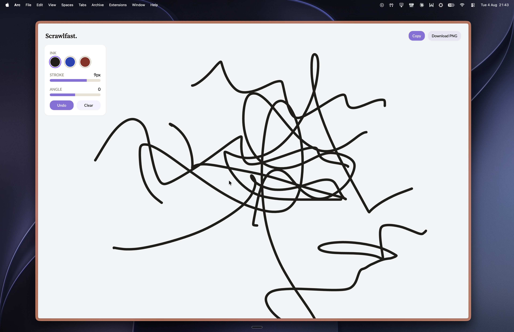

# ScrawlFast

ScrawlFast is a browser-based signature tool built with Angular and the raw Canvas 2D API, demonstrating pointer handling, stroke geometry, and image export without relying on any drawing library.

## Project Overview

The app captures a handwritten signature from a mouse, trackpad, finger, or stylus, and turns it into a transparent PNG that can be copied to the clipboard or downloaded. Strokes are stored as plain coordinate data rather than pixels, which means width, colour, and rotation can be re-applied at any time, and the final export can be rendered at a higher resolution than the screen it was drawn on.

## Core Architecture

**Data model:**
- A `Point` is `{ x, y }` in CSS pixels, relative to the canvas
- A stroke is a `Point[]` — one continuous pointer-down to pointer-up
- The drawing is a `Point[][]`, plus ink colour, stroke width, and rotation angle
- Nothing is stored as bitmap data; the canvas is always a render of the model

**Rendering:**
- The canvas bitmap is sized to `rect * devicePixelRatio` and the context scaled to match, so strokes stay sharp on high-DPI screens
- A `ResizeObserver` re-sizes and re-draws whenever the canvas changes size
- Any change to width, colour, or angle triggers a full clear-and-redraw through an Angular `effect`

## Drawing Methodology

The pointer loop follows these steps:

1. **Pointer down** captures the pointer, opens a new stroke, and bakes any pending rotation into the existing points
2. **Pointer move** pulls the full `getCoalescedEvents()` batch so fast strokes keep their intermediate samples instead of drawing as long straight segments
3. **Redraw** clears the canvas and re-renders every completed stroke, then the in-progress one
4. **Pointer up** commits the stroke to the list and writes the whole payload to `localStorage`

Strokes are smoothed with `quadraticCurveTo` through the midpoint of each pair of samples, which removes the polygonal edges a straight `lineTo` chain produces.

**Palm rejection:** once a `pen` pointer is seen, the app records that the device has a stylus and ignores `touch` pointers entirely, so a hand resting on an iPad doesn't draw. A single `activePointerId` guards against a second pointer hijacking a stroke mid-way.

**Export:** `renderToBlob` computes the rotated bounding box of every point, allocates an offscreen canvas at that size plus 16px padding, and re-renders at 3× scale. The result is a tightly-trimmed transparent PNG with no background fill.

## Features

| Feature | Detail |
|---|---|
| Ink colour | Three swatches — near-black, blue, red |
| Stroke width | 1–12px, applied to all strokes at once |
| Rotation | -20° to 20°, baked into the points on the next stroke |
| Undo / Clear | Per-stroke undo; clear also drops the saved payload |
| Copy | Transparent PNG straight to the clipboard |
| Download | Same PNG as `signature.png` |
| Persistence | Strokes and settings survive a refresh via `localStorage` |

The clipboard write is deliberately synchronous — `navigator.clipboard.write` is handed a pending blob promise rather than an awaited blob, because Safari only allows the write inside the original click gesture.

